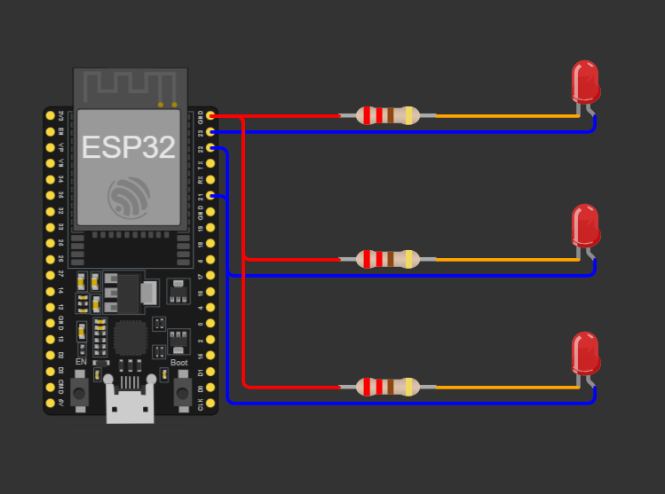

<div align="center">

  
  
  # سیستم اینترنت اشیا خانه هوشمند
**معماری و توسعه یافته توسط dmd-core**


</div>
یک سیستم اتوماسیون خانه هوشمند مبتنی بر اینترنت اشیا (IoT) که با استفاده از **ESP32**، **Blynk Cloud** و **شبیه‌ساز Wokwi** طراحی و پیاده‌سازی شده است.

این پروژه نمونه‌ای عملی از کاربرد فناوری اینترنت اشیا برای کنترل و مدیریت تجهیزات خانگی از طریق اینترنت است. ارتباط میان کاربر و تجهیزات توسط بستر ابری Blynk برقرار شده و برد ESP32 به عنوان هسته اصلی سیستم عمل می‌کند.

تمامی مراحل توسعه، آزمایش و اجرای پروژه در محیط Wokwi انجام شده است؛ بنابراین برای بررسی و استفاده از پروژه نیازی به سخت‌افزار فیزیکی وجود ندارد.

---

# 📚 فهرست مطالب

* معرفی پروژه
* قابلیت‌ها
* معماری سیستم
* فناوری‌های استفاده‌شده
* قطعات سخت‌افزاری
* پیش‌نیازهای نرم‌افزاری
* پیکربندی پایه‌ها
* طراحی مدار
* راهنمای نصب و راه‌اندازی
* تنظیمات Blynk
* شبیه‌سازی در Wokwi
* توضیح بخش‌های اصلی کد
* نحوه عملکرد سیستم
* مراحل تست
* رفع خطاهای متداول
* نکات امنیتی
* توسعه‌های آینده
* گزارش پروژه
* زبان مستندات
* نویسنده
* مجوز استفاده
* قدردانی

---

# 📌 معرفی پروژه

هدف از این پروژه طراحی و پیاده‌سازی یک سیستم ساده اما توسعه‌پذیر برای مدیریت تجهیزات خانگی از طریق اینترنت است.

در این سیستم سه بخش اصلی خانه کنترل می‌شوند:

* 💡 سیستم روشنایی
* 🔥 سیستم گرمایش
* ❄️ سیستم سرمایش

کاربر از طریق اپلیکیشن Blynk می‌تواند وضعیت هر بخش را به صورت لحظه‌ای مشاهده کرده و آن را روشن یا خاموش کند.

این پروژه برای موارد زیر مناسب است:

* دانشجویان مهندسی کامپیوتر
* علاقه‌مندان به اینترنت اشیا
* توسعه‌دهندگان سیستم‌های نهفته (Embedded Systems)
* علاقه‌مندان به خانه‌های هوشمند

---

# ✨ قابلیت‌های اصلی

* کنترل تجهیزات از راه دور
* ارتباط بلادرنگ با بستر ابری
* اتصال از طریق WiFi
* یکپارچگی کامل با Blynk Cloud
* ساختار ماژولار و قابل توسعه
* امکان شبیه‌سازی بدون نیاز به سخت‌افزار
* مناسب برای یادگیری مفاهیم IoT
* قابلیت توسعه به سیستم‌های هوشمند پیشرفته

---

# 🏗 معماری سیستم

```text
کاربر
  │
  ▼
اپلیکیشن Blynk
  │
  ▼
Blynk Cloud
  │
  ▼
ESP32
 ├── روشنایی
 ├── گرمایش
 └── سرمایش
```

### روند تبادل اطلاعات

1. کاربر یک دکمه را در اپلیکیشن Blynk فشار می‌دهد.
2. فرمان به Blynk Cloud ارسال می‌شود.
3. Blynk Cloud فرمان را به ESP32 منتقل می‌کند.
4. ESP32 فرمان را پردازش می‌کند.
5. وضعیت پایه GPIO تغییر می‌کند.
6. تجهیز مربوطه روشن یا خاموش می‌شود.

---

# 🛠 فناوری‌های استفاده‌شده

| دسته‌بندی         | فناوری            |
| ----------------- | ----------------- |
| میکروکنترلر       | ESP32             |
| زبان برنامه‌نویسی | C++               |
| فریم‌ورک توسعه    | Arduino Framework |
| پلتفرم IoT        | Blynk Cloud       |
| ارتباط            | WiFi              |
| محیط شبیه‌سازی    | Wokwi             |
| کنترل نسخه        | Git               |
| میزبانی کد        | GitHub            |

---

# 🔧 قطعات سخت‌افزاری

| قطعه           | تعداد   |
| -------------- | ------- |
| برد ESP32      | 1       |
| LED            | 3       |
| مقاومت 220 اهم | 3       |
| سیم جامپر      | چند عدد |

---

# 💻 پیش‌نیازهای نرم‌افزاری

برای اجرای پروژه به موارد زیر نیاز دارید:

* Arduino IDE
* پکیج ESP32 برای Arduino
* کتابخانه Blynk
* حساب کاربری Blynk
* شبیه‌ساز Wokwi
* Git (اختیاری)

---

# 📍 پیکربندی پایه‌ها

| تجهیز   | پایه    |
| ------- | ------- |
| روشنایی | GPIO 23 |
| گرمایش  | GPIO 22 |
| سرمایش  | GPIO 21 |

---

# 🔌 طراحی مدار

برای نمایش عملکرد سیستم از LED استفاده شده است.

### روشنایی

GPIO23 → مقاومت → LED → GND

### گرمایش

GPIO22 → مقاومت → LED → GND

### سرمایش

GPIO21 → مقاومت → LED → GND

---

# 📸 تصاویر پروژه

## مدار پروژه



## داشبورد Blynk


---

# 🚀 راهنمای نصب و راه‌اندازی

## مرحله اول: نصب Arduino IDE

آخرین نسخه Arduino IDE را دانلود و نصب کنید.

---

## مرحله دوم: نصب پکیج ESP32

در Arduino IDE وارد بخش زیر شوید:

```text
Tools → Board Manager
```

عبارت ESP32 را جستجو و نصب کنید.

---

## مرحله سوم: نصب کتابخانه Blynk

از بخش Library Manager کتابخانه Blynk را نصب کنید.

---

## مرحله چهارم: دریافت پروژه

```bash
git clone https://github.com/Dmd-core/SmartHome-ESR32.git
```

---

## مرحله پنجم: باز کردن پروژه

فایل زیر را در Arduino IDE باز کنید:

```text
sketch.ino
```

---

## مرحله ششم: تنظیم اطلاعات اتصال

اطلاعات WiFi و Blynk را وارد کنید:

```cpp
#define BLYNK_TEMPLATE_ID   "YOUR_TEMPLATE_ID"
#define BLYNK_TEMPLATE_NAME "Smart Home"
#define BLYNK_AUTH_TOKEN    "YOUR_AUTH_TOKEN"

char ssid[] = "YOUR_WIFI";
char pass[] = "YOUR_PASSWORD";
```

---

## مرحله هفتم: آپلود برنامه

برد ESP32 را انتخاب کرده و کد را آپلود کنید.

---

# ☁️ تنظیمات Blynk

## ایجاد Template

1. ورود به پنل Blynk
2. ایجاد Template جدید
3. انتخاب ESP32
4. انتخاب نوع اتصال WiFi

---

## ایجاد Datastream

| عملکرد  | Virtual Pin |
| ------- | ----------- |
| روشنایی | V0          |
| گرمایش  | V1          |
| سرمایش  | V2          |

---

## ساخت داشبورد

سه کلید (Switch) ایجاد کنید:

* V0 → روشنایی
* V1 → گرمایش
* V2 → سرمایش

---

# 🖥 شبیه‌سازی در Wokwi

برای اجرای پروژه:

1. پروژه را در Wokwi باز کنید.
2. شبیه‌سازی را اجرا کنید.
3. اتصال Blynk برقرار شود.
4. تجهیزات را از طریق اپلیکیشن کنترل کنید.

---

# ⚙️ توضیح بخش‌های اصلی کد

### روشنایی

```cpp
BLYNK_WRITE(V0)
{
    digitalWrite(LAMP_PIN, param.asInt());
}
```

کنترل روشنایی.

---

### گرمایش

```cpp
BLYNK_WRITE(V1)
{
    digitalWrite(HEATING_PIN, param.asInt());
}
```

کنترل گرمایش.

---

### سرمایش

```cpp
BLYNK_WRITE(V2)
{
    digitalWrite(COOLING_PIN, param.asInt());
}
```

کنترل سرمایش.

---

# 🔄 نحوه عملکرد سیستم

1. ESP32 به شبکه WiFi متصل می‌شود.
2. ارتباط با Blynk Cloud برقرار می‌شود.
3. کاربر فرمانی را ارسال می‌کند.
4. Blynk فرمان را منتقل می‌کند.
5. وضعیت پایه GPIO تغییر می‌کند.
6. تجهیز مربوطه فعال یا غیرفعال می‌شود.

---

# 🧪 مراحل تست

### تست روشنایی

نتیجه مورد انتظار:

LED روشنایی فعال شود.

### تست گرمایش

نتیجه مورد انتظار:

LED گرمایش فعال شود.

### تست سرمایش

نتیجه مورد انتظار:

LED سرمایش فعال شود.

---

# 🔍 رفع خطاهای متداول

### اتصال WiFi برقرار نمی‌شود

* نام شبکه را بررسی کنید.
* رمز عبور را بررسی کنید.
* اتصال اینترنت را بررسی کنید.

### دستگاه در Blynk آفلاین است

* Auth Token را بررسی کنید.
* Template ID را بررسی کنید.

### LEDها روشن نمی‌شوند

* سیم‌بندی مدار را بررسی کنید.
* پایه‌های GPIO را بررسی کنید.

---

# 🔒 نکات امنیتی

قبل از انتشار پروژه در GitHub:

هرگز موارد زیر را منتشر نکنید:

* رمز WiFi
* Auth Token
* API Key
* اطلاعات محرمانه

همیشه از مقادیر نمونه (Placeholder) استفاده کنید.

---

# 🚧 توسعه‌های آینده

قابلیت‌های پیشنهادی برای نسخه‌های بعدی:

* سنسور دما DHT22
* سنسور رطوبت
* کنترل خودکار دما
* ثبت داده‌ها
* اعلان‌های هوشمند
* دستیار صوتی
* تحلیل مصرف انرژی
* استفاده از TinyML
* تصمیم‌گیری مبتنی بر هوش مصنوعی

---

# 📄 گزارش پروژه


این گزارش توضیح می‌دهد:

* اهداف پروژه
* مفاهیم اینترنت اشیا
* پیکربندی ESP32
* یکپارچه‌سازی Blynk
* طراحی مدار
* جزئیات پیاده‌سازی
* 
---

### 🌐 دروازه مستندات
زبان مورد نظر خود را برای بررسی مستندات فنی انتخاب کنید:
* JA **[Persian Documentation](README.ja.md)** — *日本語*
* GB **[English Documentation](../README.md)** — *English*
* DE **[German Documentation](README.de.md)** — *tysk*

---

# 👨‍💻 نویسنده

**محمدحسین الماسی**

دانشجوی مهندسی کامپیوتر

زمینه‌های علاقه‌مندی:

* اینترنت اشیا (IoT)
* سیستم‌های نهفته
* توسعه ESP32
* هوش مصنوعی
* خانه‌های هوشمند

GitHub:

https://github.com/Dmd-core

---

# 📜 مجوز استفاده

این پروژه تحت مجوز MIT منتشر شده است.

استفاده، توسعه و بازنشر آن برای اهداف آموزشی و پژوهشی آزاد است.

---

# 🙏 قدردانی

با تشکر از:

* جامعه توسعه‌دهندگان ESP32
* پلتفرم Blynk
* تیم Wokwi
* جامعه متن‌باز Arduino

که ابزارهای لازم برای توسعه این پروژه را فراهم کرده‌اند.

---

## ⭐ حمایت از پروژه

اگر این پروژه برای شما مفید بوده است:

⭐ به مخزن ستاره بدهید

🍴 آن را Fork کنید

📢 با دیگران به اشتراک بگذارید

از حمایت شما سپاسگزارم.

<div align="center">
  <br>
  <a href="dmd.core.dev@gmail.com">
    
  </a>
</div>
